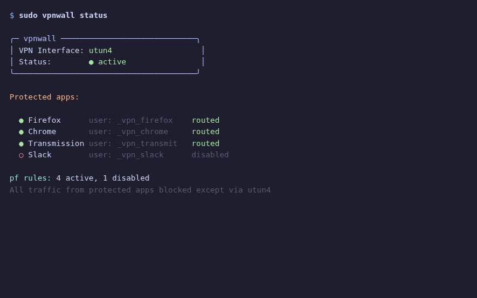

<div align="center">

# vpnwall

**Kill-switch VPN для macOS с изоляцией приложений по системным пользователям**


</div>

Принудительно направляет трафик выбранных приложений исключительно через VPN-интерфейс. При отключении VPN заблокированные приложения теряют весь доступ в интернет. Работает за счёт создания изолированных системных пользователей macOS для каждого приложения и использования правил брандмауэра `pf` (packet filter), ограничивающих их трафик только VPN-интерфейсом.

## ■ Возможности

- ❖ **Принудительный VPN для каждого приложения** — каждое приложение запускается под отдельным системным пользователем
- ❖ **Kill-switch** — нет VPN = нет интернета для настроенных приложений
- ❖ **Правила брандмауэра pf** — блокирует TCP/UDP по пользователю, разрешает только через VPN-интерфейс
- ❖ **Гибкий выбор VPN-интерфейса** — поддерживает конкретный utun или маску `utun+`
- ❖ **LaunchDaemon** — автозапуск при загрузке через включённый plist
- ❖ **Конфигурация JSON** — постоянный реестр приложений в `config.json`
- ❖ **Скрытые пользователи** — системные пользователи с префиксом `_vpnwall_`, скрытые с экрана входа

## ■ Стек

<div align="center">

| Компонент | Технология |
|-----------|------------|
| CLI | Python 3.10+ |
| Брандмауэр | macOS pf (packet filter) |
| Конфигурация | JSON |
| Автозапуск | launchd (plist) |

</div>

## ■ Как это работает

```
1. Добавить приложение — создаётся отдельный системный пользователь `_vpnwall_` и регистрируется в config.json.
2. Включить брандмауэр — загружаются правила pf, ограничивающие трафик TCP/UDP каждого пользователя-приложения только VPN-интерфейсом.
3. Запустить приложение — запускается под его отдельным изолированным системным пользователем.
4. Kill-switch — при отключении VPN pf блокирует весь исходящий трафик для настроенных пользователей-приложений.
5. Автозапуск — LaunchDaemon автоматически включает правила брандмауэра при каждом старте системы.
```

## ■ Скриншоты

<div align="center">



*Главный интерфейс с отображением статуса kill-switch VPN и настроенных приложений*

</div>

## ■ Использование

```bash
# Добавить приложение в режим только через VPN
sudo vpnwall add Arc

# Включить правила брандмауэра
sudo vpnwall enable

# Запустить приложение через VPN
sudo vpnwall run Arc

# Проверить статус
sudo vpnwall status

# Задать VPN-интерфейс
sudo vpnwall set-interface utun3

# Отключить / удалить
sudo vpnwall disable
sudo vpnwall remove Arc
```

## ■ Лицензия

MIT © [pluttan](https://github.com/pluttan)
